#  URL Preprocessing Architecture V8: Hybrid GLU Fusion Mode
> **The Hybrid GLU Fusion Pipeline** ΓÇö A dual-tower architecture combining MiniLM text embeddings with 76 heuristic features via Gated Linear Unit fusion for **maximum phishing detection power**.

---

## 🏛️ Architecture Overview

The Hybrid mode represents the **most sophisticated** processing pipeline in the V8 system. It combines canonical URL processing for clean text embeddings with an exhaustive 76-feature heuristic vector, fused through a **GLU (Gated Linear Unit) gate** that adaptively learns whether to prioritize semantic text or structural signals based on input complexity.

```mermaid
flowchart LR
    RAW["📥 Raw URL"]
    
    subgraph PREPROCESS["PREPROCESSING PIPELINE"]
        direction TB
        S0["Step 0: Ingestion"]
        S1["Step 1: Decoding"]
        S2["Step 2: Host Norm"]
        S3["Step 3: DNS Resolve"]
        S4["Step 4: Collapse"]
        S5["Step 5: Tracker Strip"]
        S6["Step 6: Canonical Anchor"]
        S7["Step 7: Feature Engineering"]
        S0 --> S1 --> S2 --> S3 --> S4 --> S5 --> S6 --> S7
    end
    
    subgraph MODEL["GLU FUSION MODEL"]
        direction TB
        TXT["🔤 Text Tower<br>MiniLM + LoRA<br>384-dim"]
        MLP["📊 Heuristic Tower<br>MLP 76→256→128<br>128-dim"]
        GLU["⚡ GLU Gate<br>sigmoid × tanh<br>256-dim"]
        CLS["🎯 Classifier<br>256→128→2"]
        TXT --> GLU
        MLP --> GLU
        GLU --> CLS
    end
    
    RAW --> PREPROCESS
    S6 -->|canonical_url| TXT
    S7 -->|76 features| MLP
    CLS -->|"Benign / Phishing"| OUT["✅ Prediction"]

    style RAW fill:#ff6b6b,color:#fff,stroke:#333
    style TXT fill:#74b9ff,color:#fff,stroke:#333
    style MLP fill:#a29bfe,color:#fff,stroke:#333
    style GLU fill:#fdcb6e,color:#333,stroke:#333
    style CLS fill:#55efc4,color:#333,stroke:#333
    style OUT fill:#2d3436,color:#fff,stroke:#55efc4
```



---

## 📋 End-to-End Processing Steps

### Phase 1: URL Cleaning & Canonicalization (Steps 0ΓÇô6)

The hybrid mode applies the **full canonical pipeline** to produce a clean, normalized URL as the text input for MiniLM.

````carousel
```text
ΓöîΓöÇΓöÇΓöÇΓöÇΓöÇΓöÇΓöÇΓöÇΓöÇΓöÇΓöÇΓöÇΓöÇΓöÇΓöÇΓöÇΓöÇΓöÇΓöÇΓöÇΓöÇΓöÇΓöÇΓöÇΓöÇΓöÇΓöÇΓöÇΓöÇΓöÇΓöÇΓöÇΓöÇΓöÇΓöÇΓöÇΓöÇΓöÇΓöÇΓöÇΓöÇΓöÇΓöÇΓöÇΓöÇΓöÇΓöÇΓöÇΓöÇΓöÇΓöÇΓöÇΓöÇΓöÇΓöÇΓöÇΓöÇΓöÇΓöÇΓöÇΓöÇΓöÇΓöÇΓöÇΓöÇΓöÇΓöÇΓöÇΓöÇΓöÇΓöÇΓöÇΓöÇΓöÇΓöÉ
Γöé  STEP 0: ELITE INGESTION & IP UNMASKING                                  Γöé
Γö£ΓöÇΓöÇΓöÇΓöÇΓöÇΓöÇΓöÇΓöÇΓöÇΓöÇΓöÇΓöÇΓöÇΓöÇΓöÇΓöÇΓöÇΓöÇΓöÇΓöÇΓöÇΓöÇΓöÇΓöÇΓöÇΓöÇΓöÇΓöÇΓöÇΓöÇΓöÇΓöÇΓöÇΓöÇΓöÇΓöÇΓöÇΓöÇΓöÇΓöÇΓöÇΓöÇΓöÇΓöÇΓöÇΓöÇΓöÇΓöÇΓöÇΓöÇΓöÇΓöÇΓöÇΓöÇΓöÇΓöÇΓöÇΓöÇΓöÇΓöÇΓöÇΓöÇΓöÇΓöÇΓöÇΓöÇΓöÇΓöÇΓöÇΓöÇΓöÇΓöÇΓöÇΓöÇΓöñ
Γöé  ΓÇó PADDING STRIP:  Remove whitespace and junk                            Γöé
│  • IP CANONICAL:   Hex/Octal/Decimal → Standard IPv4                     │
Γöé  ΓÇó LOCAL REJECT:   Drop private/local IPs                                Γöé
Γöé  ΓÇó CASE FOLDING:   Force lowercase (MiniLM uncased parity)               Γöé
ΓööΓöÇΓöÇΓöÇΓöÇΓöÇΓöÇΓöÇΓöÇΓöÇΓöÇΓöÇΓöÇΓöÇΓöÇΓöÇΓöÇΓöÇΓöÇΓöÇΓöÇΓöÇΓöÇΓöÇΓöÇΓöÇΓöÇΓöÇΓöÇΓöÇΓöÇΓöÇΓöÇΓöÇΓöÇΓöÇΓöÇΓöÇΓöÇΓöÇΓöÇΓöÇΓöÇΓöÇΓöÇΓöÇΓöÇΓöÇΓöÇΓöÇΓöÇΓöÇΓöÇΓöÇΓöÇΓöÇΓöÇΓöÇΓöÇΓöÇΓöÇΓöÇΓöÇΓöÇΓöÇΓöÇΓöÇΓöÇΓöÇΓöÇΓöÇΓöÇΓöÇΓöÇΓöÇΓöÿ
```
ΓöîΓöÇΓöÇΓöÇΓöÇΓöÇΓöÇΓöÇΓöÇΓöÇΓöÇΓöÇΓöÇΓöÇΓöÇΓöÇΓöÇΓöÇΓöÇΓöÇΓöÇΓöÇΓöÇΓöÇΓöÇΓöÇΓöÇΓöÇΓöÇΓöÇΓöÇΓöÇΓöÇΓöÇΓöÇΓöÇΓöÇΓöÇΓöÇΓöÇΓöÇΓöÇΓöÇΓöÇΓöÇΓöÇΓöÇΓöÇΓöÇΓöÇΓöÇΓöÇΓöÇΓöÇΓöÇΓöÇΓöÇΓöÇΓöÇΓöÇΓöÇΓöÇΓöÇΓöÇΓöÇΓöÇΓöÇΓöÇΓöÇΓöÇΓöÇΓöÇΓöÇΓöÇΓöÇΓöÉ
Γöé  STEP 1: RECURSIVE PERCENT DECODING (10 LAYERS)                          Γöé
Γö£ΓöÇΓöÇΓöÇΓöÇΓöÇΓöÇΓöÇΓöÇΓöÇΓöÇΓöÇΓöÇΓöÇΓöÇΓöÇΓöÇΓöÇΓöÇΓöÇΓöÇΓöÇΓöÇΓöÇΓöÇΓöÇΓöÇΓöÇΓöÇΓöÇΓöÇΓöÇΓöÇΓöÇΓöÇΓöÇΓöÇΓöÇΓöÇΓöÇΓöÇΓöÇΓöÇΓöÇΓöÇΓöÇΓöÇΓöÇΓöÇΓöÇΓöÇΓöÇΓöÇΓöÇΓöÇΓöÇΓöÇΓöÇΓöÇΓöÇΓöÇΓöÇΓöÇΓöÇΓöÇΓöÇΓöÇΓöÇΓöÇΓöÇΓöÇΓöÇΓöÇΓöÇΓöÇΓöñ
Γöé  ΓÇó 10-Pass recursion to expose deeply-hidden payloads                    Γöé
│  • Collapses multi-encoded traversals (%25252e → .)                     │
Γö£ΓöÇΓöÇΓöÇΓöÇΓöÇΓöÇΓöÇΓöÇΓöÇΓöÇΓöÇΓöÇΓöÇΓöÇΓöÇΓöÇΓöÇΓöÇΓöÇΓöÇΓöÇΓöÇΓöÇΓöÇΓöÇΓöÇΓöÇΓöÇΓöÇΓöÇΓöÇΓöÇΓöÇΓöÇΓöÇΓöÇΓöÇΓöÇΓöÇΓöÇΓöÇΓöÇΓöÇΓöÇΓöÇΓöÇΓöÇΓöÇΓöÇΓöÇΓöÇΓöÇΓöÇΓöÇΓöÇΓöÇΓöÇΓöÇΓöÇΓöÇΓöÇΓöÇΓöÇΓöÇΓöÇΓöÇΓöÇΓöÇΓöÇΓöÇΓöÇΓöÇΓöÇΓöÇΓöñ
Γöé  STEP 2: HOST NORMALIZATION                                              Γöé
Γö£ΓöÇΓöÇΓöÇΓöÇΓöÇΓöÇΓöÇΓöÇΓöÇΓöÇΓöÇΓöÇΓöÇΓöÇΓöÇΓöÇΓöÇΓöÇΓöÇΓöÇΓöÇΓöÇΓöÇΓöÇΓöÇΓöÇΓöÇΓöÇΓöÇΓöÇΓöÇΓöÇΓöÇΓöÇΓöÇΓöÇΓöÇΓöÇΓöÇΓöÇΓöÇΓöÇΓöÇΓöÇΓöÇΓöÇΓöÇΓöÇΓöÇΓöÇΓöÇΓöÇΓöÇΓöÇΓöÇΓöÇΓöÇΓöÇΓöÇΓöÇΓöÇΓöÇΓöÇΓöÇΓöÇΓöÇΓöÇΓöÇΓöÇΓöÇΓöÇΓöÇΓöÇΓöÇΓöñ
Γöé  ΓÇó NFKC + IDNA 2008 Punycode                                             Γöé
Γöé  ΓÇó Leading/Trailing dot stripping                                        Γöé
ΓööΓöÇΓöÇΓöÇΓöÇΓöÇΓöÇΓöÇΓöÇΓöÇΓöÇΓöÇΓöÇΓöÇΓöÇΓöÇΓöÇΓöÇΓöÇΓöÇΓöÇΓöÇΓöÇΓöÇΓöÇΓöÇΓöÇΓöÇΓöÇΓöÇΓöÇΓöÇΓöÇΓöÇΓöÇΓöÇΓöÇΓöÇΓöÇΓöÇΓöÇΓöÇΓöÇΓöÇΓöÇΓöÇΓöÇΓöÇΓöÇΓöÇΓöÇΓöÇΓöÇΓöÇΓöÇΓöÇΓöÇΓöÇΓöÇΓöÇΓöÇΓöÇΓöÇΓöÇΓöÇΓöÇΓöÇΓöÇΓöÇΓöÇΓöÇΓöÇΓöÇΓöÇΓöÇΓöÿ
```
ΓöîΓöÇΓöÇΓöÇΓöÇΓöÇΓöÇΓöÇΓöÇΓöÇΓöÇΓöÇΓöÇΓöÇΓöÇΓöÇΓöÇΓöÇΓöÇΓöÇΓöÇΓöÇΓöÇΓöÇΓöÇΓöÇΓöÇΓöÇΓöÇΓöÇΓöÇΓöÇΓöÇΓöÇΓöÇΓöÇΓöÇΓöÇΓöÇΓöÇΓöÇΓöÇΓöÇΓöÇΓöÇΓöÇΓöÇΓöÇΓöÇΓöÇΓöÇΓöÇΓöÇΓöÇΓöÇΓöÇΓöÇΓöÇΓöÇΓöÇΓöÇΓöÇΓöÇΓöÇΓöÇΓöÇΓöÇΓöÇΓöÇΓöÇΓöÇΓöÇΓöÇΓöÇΓöÇΓöÉ
Γöé  STEP 3: PRECISION IP RESOLUTION (5s TIMEOUT)                            Γöé
Γö£ΓöÇΓöÇΓöÇΓöÇΓöÇΓöÇΓöÇΓöÇΓöÇΓöÇΓöÇΓöÇΓöÇΓöÇΓöÇΓöÇΓöÇΓöÇΓöÇΓöÇΓöÇΓöÇΓöÇΓöÇΓöÇΓöÇΓöÇΓöÇΓöÇΓöÇΓöÇΓöÇΓöÇΓöÇΓöÇΓöÇΓöÇΓöÇΓöÇΓöÇΓöÇΓöÇΓöÇΓöÇΓöÇΓöÇΓöÇΓöÇΓöÇΓöÇΓöÇΓöÇΓöÇΓöÇΓöÇΓöÇΓöÇΓöÇΓöÇΓöÇΓöÇΓöÇΓöÇΓöÇΓöÇΓöÇΓöÇΓöÇΓöÇΓöÇΓöÇΓöÇΓöÇΓöÇΓöñ
│  • Reverse DNS → Domain Injection → Full Restart                        │
Γöé  ΓÇó Captures slow-responding ISP nodes (botnet infrastructure)            Γöé
Γö£ΓöÇΓöÇΓöÇΓöÇΓöÇΓöÇΓöÇΓöÇΓöÇΓöÇΓöÇΓöÇΓöÇΓöÇΓöÇΓöÇΓöÇΓöÇΓöÇΓöÇΓöÇΓöÇΓöÇΓöÇΓöÇΓöÇΓöÇΓöÇΓöÇΓöÇΓöÇΓöÇΓöÇΓöÇΓöÇΓöÇΓöÇΓöÇΓöÇΓöÇΓöÇΓöÇΓöÇΓöÇΓöÇΓöÇΓöÇΓöÇΓöÇΓöÇΓöÇΓöÇΓöÇΓöÇΓöÇΓöÇΓöÇΓöÇΓöÇΓöÇΓöÇΓöÇΓöÇΓöÇΓöÇΓöÇΓöÇΓöÇΓöÇΓöÇΓöÇΓöÇΓöÇΓöÇΓöñ
Γöé  STEP 4: STRUCTURAL COLLAPSING & BLOB MASKING                            Γöé
Γö£ΓöÇΓöÇΓöÇΓöÇΓöÇΓöÇΓöÇΓöÇΓöÇΓöÇΓöÇΓöÇΓöÇΓöÇΓöÇΓöÇΓöÇΓöÇΓöÇΓöÇΓöÇΓöÇΓöÇΓöÇΓöÇΓöÇΓöÇΓöÇΓöÇΓöÇΓöÇΓöÇΓöÇΓöÇΓöÇΓöÇΓöÇΓöÇΓöÇΓöÇΓöÇΓöÇΓöÇΓöÇΓöÇΓöÇΓöÇΓöÇΓöÇΓöÇΓöÇΓöÇΓöÇΓöÇΓöÇΓöÇΓöÇΓöÇΓöÇΓöÇΓöÇΓöÇΓöÇΓöÇΓöÇΓöÇΓöÇΓöÇΓöÇΓöÇΓöÇΓöÇΓöÇΓöÇΓöñ
Γöé  ΓÇó PORT STRIPPING: Remove default ports (:443, :80)                      Γöé
│  • PATH SANITIZE:  Resolve traversals (/login/../ → /)                   │
Γöé  ΓÇó BLOB MASKING:   Mask HEX/B64 blobs for consistency                    Γöé
ΓööΓöÇΓöÇΓöÇΓöÇΓöÇΓöÇΓöÇΓöÇΓöÇΓöÇΓöÇΓöÇΓöÇΓöÇΓöÇΓöÇΓöÇΓöÇΓöÇΓöÇΓöÇΓöÇΓöÇΓöÇΓöÇΓöÇΓöÇΓöÇΓöÇΓöÇΓöÇΓöÇΓöÇΓöÇΓöÇΓöÇΓöÇΓöÇΓöÇΓöÇΓöÇΓöÇΓöÇΓöÇΓöÇΓöÇΓöÇΓöÇΓöÇΓöÇΓöÇΓöÇΓöÇΓöÇΓöÇΓöÇΓöÇΓöÇΓöÇΓöÇΓöÇΓöÇΓöÇΓöÇΓöÇΓöÇΓöÇΓöÇΓöÇΓöÇΓöÇΓöÇΓöÇΓöÇΓöÿ
```
ΓöîΓöÇΓöÇΓöÇΓöÇΓöÇΓöÇΓöÇΓöÇΓöÇΓöÇΓöÇΓöÇΓöÇΓöÇΓöÇΓöÇΓöÇΓöÇΓöÇΓöÇΓöÇΓöÇΓöÇΓöÇΓöÇΓöÇΓöÇΓöÇΓöÇΓöÇΓöÇΓöÇΓöÇΓöÇΓöÇΓöÇΓöÇΓöÇΓöÇΓöÇΓöÇΓöÇΓöÇΓöÇΓöÇΓöÇΓöÇΓöÇΓöÇΓöÇΓöÇΓöÇΓöÇΓöÇΓöÇΓöÇΓöÇΓöÇΓöÇΓöÇΓöÇΓöÇΓöÇΓöÇΓöÇΓöÇΓöÇΓöÇΓöÇΓöÇΓöÇΓöÇΓöÇΓöÇΓöÉ
Γöé  STEP 5: QUERY DYNAMICS & TRACKER STRIP                                  Γöé
Γö£ΓöÇΓöÇΓöÇΓöÇΓöÇΓöÇΓöÇΓöÇΓöÇΓöÇΓöÇΓöÇΓöÇΓöÇΓöÇΓöÇΓöÇΓöÇΓöÇΓöÇΓöÇΓöÇΓöÇΓöÇΓöÇΓöÇΓöÇΓöÇΓöÇΓöÇΓöÇΓöÇΓöÇΓöÇΓöÇΓöÇΓöÇΓöÇΓöÇΓöÇΓöÇΓöÇΓöÇΓöÇΓöÇΓöÇΓöÇΓöÇΓöÇΓöÇΓöÇΓöÇΓöÇΓöÇΓöÇΓöÇΓöÇΓöÇΓöÇΓöÇΓöÇΓöÇΓöÇΓöÇΓöÇΓöÇΓöÇΓöÇΓöÇΓöÇΓöÇΓöÇΓöÇΓöÇΓöñ
Γöé  ΓÇó Remove 50+ tracking params (utm_*, gclid, fbclid)                     Γöé
Γöé  ΓÇó Sort params alphabetically (deterministic)                            Γöé
│  • Lowercase percent-encoding (%2A → %2a)                               │
Γö£ΓöÇΓöÇΓöÇΓöÇΓöÇΓöÇΓöÇΓöÇΓöÇΓöÇΓöÇΓöÇΓöÇΓöÇΓöÇΓöÇΓöÇΓöÇΓöÇΓöÇΓöÇΓöÇΓöÇΓöÇΓöÇΓöÇΓöÇΓöÇΓöÇΓöÇΓöÇΓöÇΓöÇΓöÇΓöÇΓöÇΓöÇΓöÇΓöÇΓöÇΓöÇΓöÇΓöÇΓöÇΓöÇΓöÇΓöÇΓöÇΓöÇΓöÇΓöÇΓöÇΓöÇΓöÇΓöÇΓöÇΓöÇΓöÇΓöÇΓöÇΓöÇΓöÇΓöÇΓöÇΓöÇΓöÇΓöÇΓöÇΓöÇΓöÇΓöÇΓöÇΓöÇΓöÇΓöñ
Γöé  STEP 6: FINAL CANONICAL ANCHOR                                          Γöé
Γö£ΓöÇΓöÇΓöÇΓöÇΓöÇΓöÇΓöÇΓöÇΓöÇΓöÇΓöÇΓöÇΓöÇΓöÇΓöÇΓöÇΓöÇΓöÇΓöÇΓöÇΓöÇΓöÇΓöÇΓöÇΓöÇΓöÇΓöÇΓöÇΓöÇΓöÇΓöÇΓöÇΓöÇΓöÇΓöÇΓöÇΓöÇΓöÇΓöÇΓöÇΓöÇΓöÇΓöÇΓöÇΓöÇΓöÇΓöÇΓöÇΓöÇΓöÇΓöÇΓöÇΓöÇΓöÇΓöÇΓöÇΓöÇΓöÇΓöÇΓöÇΓöÇΓöÇΓöÇΓöÇΓöÇΓöÇΓöÇΓöÇΓöÇΓöÇΓöÇΓöÇΓöÇΓöÇΓöñ
Γöé  ΓÇó NFKC + Punycode host stability                                        Γöé
Γöé  ΓÇó 100% ASCII enforced for DB/tokenizer compatibility                    Γöé
│  → OUTPUT: canonical_url (clean text for MiniLM)                         │
ΓööΓöÇΓöÇΓöÇΓöÇΓöÇΓöÇΓöÇΓöÇΓöÇΓöÇΓöÇΓöÇΓöÇΓöÇΓöÇΓöÇΓöÇΓöÇΓöÇΓöÇΓöÇΓöÇΓöÇΓöÇΓöÇΓöÇΓöÇΓöÇΓöÇΓöÇΓöÇΓöÇΓöÇΓöÇΓöÇΓöÇΓöÇΓöÇΓöÇΓöÇΓöÇΓöÇΓöÇΓöÇΓöÇΓöÇΓöÇΓöÇΓöÇΓöÇΓöÇΓöÇΓöÇΓöÇΓöÇΓöÇΓöÇΓöÇΓöÇΓöÇΓöÇΓöÇΓöÇΓöÇΓöÇΓöÇΓöÇΓöÇΓöÇΓöÇΓöÇΓöÇΓöÇΓöÇΓöÿ
```
````

---

### Phase 2: Heuristic Feature Engineering (Step 7)

After canonicalization, the pipeline extracts **76 heuristic features** from the original URL structure. These features capture adversarial signals that would be lost during canonicalization.

```text
ΓöîΓöÇΓöÇΓöÇΓöÇΓöÇΓöÇΓöÇΓöÇΓöÇΓöÇΓöÇΓöÇΓöÇΓöÇΓöÇΓöÇΓöÇΓöÇΓöÇΓöÇΓöÇΓöÇΓöÇΓöÇΓöÇΓöÇΓöÇΓöÇΓöÇΓöÇΓöÇΓöÇΓöÇΓöÇΓöÇΓöÇΓöÇΓöÇΓöÇΓöÇΓöÇΓöÇΓöÇΓöÇΓöÇΓöÇΓöÇΓöÇΓöÇΓöÇΓöÇΓöÇΓöÇΓöÇΓöÇΓöÇΓöÇΓöÇΓöÇΓöÇΓöÇΓöÇΓöÇΓöÇΓöÇΓöÇΓöÇΓöÇΓöÇΓöÇΓöÇΓöÇΓöÇΓöÇΓöÉ
Γöé  STEP 7: HEURISTIC FEATURE ENGINEERING (76 FEATURES)                     Γöé
Γö£ΓöÇΓöÇΓöÇΓöÇΓöÇΓöÇΓöÇΓöÇΓöÇΓöÇΓöÇΓöÇΓöÇΓöÇΓöÇΓöÇΓöÇΓöÇΓöÇΓöÇΓöÇΓöÇΓöÇΓöÇΓöÇΓöÇΓöÇΓöÇΓöÇΓöÇΓöÇΓöÇΓöÇΓöÇΓöÇΓöÇΓöÇΓöÇΓöÇΓöÇΓöÇΓöÇΓöÇΓöÇΓöÇΓöÇΓöÇΓöÇΓöÇΓöÇΓöÇΓöÇΓöÇΓöÇΓöÇΓöÇΓöÇΓöÇΓöÇΓöÇΓöÇΓöÇΓöÇΓöÇΓöÇΓöÇΓöÇΓöÇΓöÇΓöÇΓöÇΓöÇΓöÇΓöÇΓöñ
Γöé                                                                          Γöé
Γöé  ΓöÇΓöÇΓöÇ 10 Numeric Features (Z-Score Normalized) ΓöÇΓöÇΓöÇ                        Γöé
Γöé  Γöé h_entropy_url       Γöé Shannon entropy of full URL                     Γöé
Γöé  Γöé h_entropy_path      Γöé Shannon entropy of path component               Γöé
Γöé  Γöé h_entropy_query     Γöé Shannon entropy of query string                 Γöé
Γöé  Γöé h_url_length        Γöé Total URL character count                       Γöé
Γöé  Γöé h_path_depth        Γöé Number of path segments                         Γöé
Γöé  Γöé h_subdomain_count   Γöé Number of subdomains                            Γöé
Γöé  Γöé h_digit_ratio       Γöé Ratio of digits to total characters             Γöé
Γöé                                                                          Γöé
Γöé  ΓöÇΓöÇΓöÇ 6 Binary Features (Pass-Through) ΓöÇΓöÇΓöÇ                                Γöé
Γöé  Γöé h_is_ip_host        Γöé Host is an IP address (not domain)              Γöé
Γöé  Γöé h_has_https         Γöé URL uses HTTPS scheme                           Γöé
Γöé  Γöé h_has_port          Γöé Non-standard port present                       Γöé
Γöé  Γöé h_tld_risk_normal   Γöé TLD in normal risk category                     Γöé
Γöé  Γöé h_tld_risk_context  Γöé TLD in contextual risk category                 Γöé
Γöé  Γöé h_tld_risk_high     Γöé TLD in high risk category                       Γöé
Γöé                                                                          Γöé
Γöé  ΓöÇΓöÇΓöÇ 60 Per-Flag Boolean Features (Pass-Through) ΓöÇΓöÇΓöÇ                     Γöé
Γöé  Γöé hF_NENG  Γöé Non-English characters detected                            Γöé
Γöé  Γöé hF_TSQ   Γöé Suspicious TLD-squatting pattern                           Γöé
Γöé  Γöé hF_CRED  Γöé Credential harvesting keywords                             Γöé
Γöé  Γöé hF_UNI   Γöé Unicode/Punycode manipulation                              Γöé
Γöé  Γöé hF_OBF   Γöé Path/URL obfuscation detected                              Γöé
Γöé  Γöé hF_BYP   Γöé Security bypass patterns                                   Γöé
Γöé  Γöé hF_PROS  Γöé Protocol/scheme anomalies                                  Γöé
Γöé  Γöé hF_BMIM  Γöé Brand mimicry detected                                     Γöé
Γöé  Γöé ... (60 total flags from 16 primary categories)                       Γöé
Γöé                                                                          Γöé
ΓööΓöÇΓöÇΓöÇΓöÇΓöÇΓöÇΓöÇΓöÇΓöÇΓöÇΓöÇΓöÇΓöÇΓöÇΓöÇΓöÇΓöÇΓöÇΓöÇΓöÇΓöÇΓöÇΓöÇΓöÇΓöÇΓöÇΓöÇΓöÇΓöÇΓöÇΓöÇΓöÇΓöÇΓöÇΓöÇΓöÇΓöÇΓöÇΓöÇΓöÇΓöÇΓöÇΓöÇΓöÇΓöÇΓöÇΓöÇΓöÇΓöÇΓöÇΓöÇΓöÇΓöÇΓöÇΓöÇΓöÇΓöÇΓöÇΓöÇΓöÇΓöÇΓöÇΓöÇΓöÇΓöÇΓöÇΓöÇΓöÇΓöÇΓöÇΓöÇΓöÇΓöÇΓöÇΓöÿ
```

> [!IMPORTANT]
> **Normalization Strategy**: Only the 10 numeric features are Z-score normalized using **training set statistics only** ΓÇö preventing data leakage to validation/test. Binary and flag features pass through as 0/1.

---

### Phase 3: Dual-Tower GLU Fusion Training (Step 8)

```text
ΓöîΓöÇΓöÇΓöÇΓöÇΓöÇΓöÇΓöÇΓöÇΓöÇΓöÇΓöÇΓöÇΓöÇΓöÇΓöÇΓöÇΓöÇΓöÇΓöÇΓöÇΓöÇΓöÇΓöÇΓöÇΓöÇΓöÇΓöÇΓöÇΓöÇΓöÇΓöÇΓöÇΓöÇΓöÇΓöÇΓöÇΓöÇΓöÇΓöÇΓöÇΓöÇΓöÇΓöÇΓöÇΓöÇΓöÇΓöÇΓöÇΓöÇΓöÇΓöÇΓöÇΓöÇΓöÇΓöÇΓöÇΓöÇΓöÇΓöÇΓöÇΓöÇΓöÇΓöÇΓöÇΓöÇΓöÇΓöÇΓöÇΓöÇΓöÇΓöÇΓöÇΓöÇΓöÇΓöÉ
Γöé  STEP 8: DUAL-TOWER GLU FUSION MODEL                                     Γöé
Γö£ΓöÇΓöÇΓöÇΓöÇΓöÇΓöÇΓöÇΓöÇΓöÇΓöÇΓöÇΓöÇΓöÇΓöÇΓöÇΓöÇΓöÇΓöÇΓöÇΓöÇΓöÇΓöÇΓöÇΓöÇΓöÇΓöÇΓöÇΓöÇΓöÇΓöÇΓöÇΓöÇΓöÇΓöÇΓöÇΓöÇΓöÇΓöÇΓöÇΓöÇΓöÇΓöÇΓöÇΓöÇΓöÇΓöÇΓöÇΓöÇΓöÇΓöÇΓöÇΓöÇΓöÇΓöÇΓöÇΓöÇΓöÇΓöÇΓöÇΓöÇΓöÇΓöÇΓöÇΓöÇΓöÇΓöÇΓöÇΓöÇΓöÇΓöÇΓöÇΓöÇΓöÇΓöÇΓöñ
Γöé                                                                          Γöé
Γöé  ΓòöΓòÉΓòÉΓòÉΓòÉΓòÉΓòÉΓòÉΓòÉΓòÉΓòÉΓòÉΓòÉΓòÉΓòÉΓòÉΓòÉΓòÉΓòÉΓòÉΓòÉΓòÉΓòÉΓòÉΓòÉΓòÉΓòÉΓòÉΓòÉΓòÉΓòÉΓòÉΓòÉΓòÉΓòÉΓòÉΓòÉΓòÉΓòÉΓòÉΓòÉΓòÉΓòÉΓòÉΓòÉΓòÉΓòÉΓòÉΓòÉΓòÉΓòÉΓòÉΓòÉΓòÉΓòÉΓòÉΓòÉΓòÉΓòÉΓòÉΓòÉΓòÉΓòÉΓòÉΓòÉΓòÉΓòÉΓòÉΓòù   Γöé
Γöé  Γòæ                    TEXT TOWER (384-dim)                           Γòæ   Γöé
Γöé  Γòæ  canonical_url ΓöÇΓöÇΓû╢ [MiniLM-L12-H384-uncased + LoRA] ΓöÇΓöÇΓû╢ CLS      Γòæ   Γöé
Γöé  Γòæ                     (33.7M params, mostly frozen)                 Γòæ   Γöé
Γöé  ΓòÜΓòÉΓòÉΓòÉΓòÉΓòÉΓòÉΓòÉΓòÉΓòÉΓòÉΓòÉΓòÉΓòÉΓòÉΓòÉΓòÉΓòÉΓòÉΓòÉΓòÉΓòÉΓòÉΓòÉΓòÉΓòÉΓòÉΓòÉΓòÉΓòÉΓòÉΓòñΓòÉΓòÉΓòÉΓòÉΓòÉΓòÉΓòÉΓòÉΓòÉΓòÉΓòÉΓòÉΓòÉΓòÉΓòÉΓòÉΓòÉΓòÉΓòÉΓòÉΓòÉΓòÉΓòÉΓòÉΓòÉΓòÉΓòÉΓòÉΓòÉΓòÉΓòÉΓòÉΓòÉΓòÉΓòÉΓòÉΓò¥   Γöé
Γöé                                 Γöé                                        Γöé
Γöé  ΓòöΓòÉΓòÉΓòÉΓòÉΓòÉΓòÉΓòÉΓòÉΓòÉΓòÉΓòÉΓòÉΓòÉΓòÉΓòÉΓòÉΓòÉΓòÉΓòÉΓòÉΓòÉΓòÉΓòÉΓòÉΓòÉΓòÉΓòÉΓòÉΓòÉΓòÉΓò¬ΓòÉΓòÉΓòÉΓòÉΓòÉΓòÉΓòÉΓòÉΓòÉΓòÉΓòÉΓòÉΓòÉΓòÉΓòÉΓòÉΓòÉΓòÉΓòÉΓòÉΓòÉΓòÉΓòÉΓòÉΓòÉΓòÉΓòÉΓòÉΓòÉΓòÉΓòÉΓòÉΓòÉΓòÉΓòÉΓòÉΓòù   Γöé
Γöé  Γòæ               HEURISTIC TOWER (128-dim)         Γöé                 Γòæ   Γöé
│  ║  76 features ──▶ [Lin 76→256 + LayerNorm + GELU]│                ║    │
Γöé  Γòæ              ΓöÇΓöÇΓû╢ [Dropout 0.1]                  Γöé                Γòæ    Γöé
│  ║              ──▶ [Lin 256→128 + LayerNorm + GELU]                ║    │
Γöé  Γòæ              ΓöÇΓöÇΓû╢ [Dropout 0.1]           ΓöÇΓöÇΓöÇΓöÇΓöÇΓöÇΓöÇΓöÿ                Γòæ    Γöé
Γöé  ΓòÜΓòÉΓòÉΓòÉΓòÉΓòÉΓòÉΓòÉΓòÉΓòÉΓòÉΓòÉΓòÉΓòÉΓòÉΓòÉΓòÉΓòÉΓòÉΓòÉΓòÉΓòÉΓòÉΓòÉΓòÉΓòÉΓòÉΓòÉΓòÉΓòÉΓòÉΓòñΓòÉΓòÉΓòÉΓòÉΓòÉΓòÉΓòÉΓòÉΓòÉΓòÉΓòÉΓòÉΓòÉΓòÉΓòÉΓòÉΓòÉΓòÉΓòÉΓòÉΓòÉΓòÉΓòÉΓòÉΓòÉΓòÉΓòÉΓòÉΓòÉΓòÉΓòÉΓòÉΓòÉΓòÉΓòÉΓòÉΓò¥    Γöé
Γöé                                 Γöé                                         Γöé
Γöé  ΓòöΓòÉΓòÉΓòÉΓòÉΓòÉΓòÉΓòÉΓòÉΓòÉΓòÉΓòÉΓòÉΓòÉΓòÉΓòÉΓòÉΓòÉΓòÉΓòÉΓòÉΓòÉΓòÉΓòÉΓòÉΓòÉΓòÉΓòÉΓòÉΓòÉΓòÉΓû╝ΓòÉΓòÉΓòÉΓòÉΓòÉΓòÉΓòÉΓòÉΓòÉΓòÉΓòÉΓòÉΓòÉΓòÉΓòÉΓòÉΓòÉΓòÉΓòÉΓòÉΓòÉΓòÉΓòÉΓòÉΓòÉΓòÉΓòÉΓòÉΓòÉΓòÉΓòÉΓòÉΓòÉΓòÉΓòÉΓòÉΓòù    Γöé
Γöé  Γòæ                    GLU GATE (256-dim)                             Γòæ    Γöé
│  ║  [384 + 128 = 512] ──▶ Lin(512→256) → sigmoid ──┐                ║    │
│  ║  [384 + 128 = 512] ──▶ Lin(512→256) → tanh    ──┤                ║    │
│  ║                                     sigmoid × tanh = fusion       ║    │
Γöé  ΓòÜΓòÉΓòÉΓòÉΓòÉΓòÉΓòÉΓòÉΓòÉΓòÉΓòÉΓòÉΓòÉΓòÉΓòÉΓòÉΓòÉΓòÉΓòÉΓòÉΓòÉΓòÉΓòÉΓòÉΓòÉΓòÉΓòÉΓòÉΓòÉΓòÉΓòÉΓòñΓòÉΓòÉΓòÉΓòÉΓòÉΓòÉΓòÉΓòÉΓòÉΓòÉΓòÉΓòÉΓòÉΓòÉΓòÉΓòÉΓòÉΓòÉΓòÉΓòÉΓòÉΓòÉΓòÉΓòÉΓòÉΓòÉΓòÉΓòÉΓòÉΓòÉΓòÉΓòÉΓòÉΓòÉΓòÉΓòÉΓò¥    Γöé
Γöé                                 Γöé                                        Γöé
Γöé  ΓòöΓòÉΓòÉΓòÉΓòÉΓòÉΓòÉΓòÉΓòÉΓòÉΓòÉΓòÉΓòÉΓòÉΓòÉΓòÉΓòÉΓòÉΓòÉΓòÉΓòÉΓòÉΓòÉΓòÉΓòÉΓòÉΓòÉΓòÉΓòÉΓòÉΓòÉΓû╝ΓòÉΓòÉΓòÉΓòÉΓòÉΓòÉΓòÉΓòÉΓòÉΓòÉΓòÉΓòÉΓòÉΓòÉΓòÉΓòÉΓòÉΓòÉΓòÉΓòÉΓòÉΓòÉΓòÉΓòÉΓòÉΓòÉΓòÉΓòÉΓòÉΓòÉΓòÉΓòÉΓòÉΓòÉΓòÉΓòù    Γöé
Γöé  Γòæ                 CLASSIFIER HEAD                                  Γòæ    Γöé
│  ║  [256] ──▶ LayerNorm ──▶ [Lin 256→128] ──▶ GELU ──▶ Dropout    ║    │
│  ║        ──▶ [Lin 128→2]  ──▶  Logits (Benign / Phishing)         ║    │
Γöé  ΓòÜΓòÉΓòÉΓòÉΓòÉΓòÉΓòÉΓòÉΓòÉΓòÉΓòÉΓòÉΓòÉΓòÉΓòÉΓòÉΓòÉΓòÉΓòÉΓòÉΓòÉΓòÉΓòÉΓòÉΓòÉΓòÉΓòÉΓòÉΓòÉΓòÉΓòÉΓòÉΓòÉΓòÉΓòÉΓòÉΓòÉΓòÉΓòÉΓòÉΓòÉΓòÉΓòÉΓòÉΓòÉΓòÉΓòÉΓòÉΓòÉΓòÉΓòÉΓòÉΓòÉΓòÉΓòÉΓòÉΓòÉΓòÉΓòÉΓòÉΓòÉΓòÉΓòÉΓòÉΓòÉΓòÉΓòÉΓò¥    Γöé
Γöé                                                                          Γöé
Γöé  ΓöÇΓöÇΓöÇ Training Configuration ΓöÇΓöÇΓöÇ                                          Γöé
Γöé  ΓÇó Loss:     Focal Loss (╬│=2.0, ╬▒=[0.35, 0.65])                          Γöé
Γöé  ΓÇó LoRA:     r=32, ╬▒=64, target=[query, key, value, dense]               Γöé
Γöé  ΓÇó Optimizer: AdamW, LR=3e-5, cosine decay with warmup                   Γöé
Γöé  ΓÇó AMP:     Mixed precision (FP16/FP32)                                  Γöé
Γöé  ΓÇó Grad:    Accumulation=2, Clip=1.0                                     Γöé
Γöé  ΓÇó Export:   ONNX with 3 inputs (INT8 quantized)                         Γöé
ΓööΓöÇΓöÇΓöÇΓöÇΓöÇΓöÇΓöÇΓöÇΓöÇΓöÇΓöÇΓöÇΓöÇΓöÇΓöÇΓöÇΓöÇΓöÇΓöÇΓöÇΓöÇΓöÇΓöÇΓöÇΓöÇΓöÇΓöÇΓöÇΓöÇΓöÇΓöÇΓöÇΓöÇΓöÇΓöÇΓöÇΓöÇΓöÇΓöÇΓöÇΓöÇΓöÇΓöÇΓöÇΓöÇΓöÇΓöÇΓöÇΓöÇΓöÇΓöÇΓöÇΓöÇΓöÇΓöÇΓöÇΓöÇΓöÇΓöÇΓöÇΓöÇΓöÇΓöÇΓöÇΓöÇΓöÇΓöÇΓöÇΓöÇΓöÇΓöÇΓöÇΓöÇΓöÇΓöÿ
```

---

## 🧬 Why GLU Fusion?

The **Gated Linear Unit** fusion mechanism is the key innovation of the hybrid mode:

| Approach | Mechanism | Limitation |
| :--- | :--- | :--- |
| **Concatenation** | `[text; features]` → classifier | Fixed blending ratio, ignores input complexity |
| **Attention Fusion** | Cross-attention over features | Expensive, overkill for structured features |
| **GLU Gate** ⚡ | `sigmoid(W₁x) × tanh(W₂x)` | **Adaptive** — learns to gate per-sample |

The GLU gate allows the model to:
- **Prioritize text** for well-formed URLs with clear semantic patterns
- **Prioritize heuristics** for obfuscated URLs where text is opaque but structural flags are strong
- **Blend both** for ambiguous cases where neither signal alone is sufficient

---

## 📊 Output Schema (79 Columns)

The hybrid preprocessing produces the richest dataset in the v8 system:

| Column Group | Count | Type | Description |
| :--- | :---: | :--- | :--- |
| `input` | 1 | string | Canonical URL for MiniLM tokenization |
| `label` | 1 | int (0/1) | 0 = Benign, 1 = Phishing |
| `h_*` numeric | 10 | float | Entropy, length, depth, ratios (Z-score normalized) |
| `h_*` binary | 6 | int (0/1) | IP host, HTTPS, port, TLD risk levels |
| `hF_*` flags | 60 | int (0/1) | Per-flag booleans from 60+ security detectors |
| `h_primary_category` | 1 | string | **Dropped** during training (leaky) |
| **Total** | **79** | ΓÇö | **76 usable features** for model |

---

## 📐 Model Parameter Breakdown

| Component | Parameters | Trainable | Description |
| :--- | ---: | :---: | :--- |
| Text Encoder | 33,360,000 | ❄️ Frozen | MiniLM-L12-H384-uncased |
| LoRA Adapters | 1,339,392 | ✅ Yes | Applied to Q, K, V, Dense layers |
| Heuristic MLP | 53,376 | ✅ Yes | 76 → 256 → 128 with LayerNorm + GELU |
| GLU Gate | 263,168 | ✅ Yes | 512 → 256 sigmoid × tanh |
| Classifier Head | 66,820 | ✅ Yes | 256 → 128 → 2 |
| **Total** | **35,082,756** | **1,372,802 (3.91%)** | |

---

## 🎯 Model Results (MiniLM HybridFF v3)

> **Test Evaluation** ΓÇö 3,507,694 samples | Epoch 8 | Threshold: 0.50 |

### Performance Metrics

| Metric | Target | Achieved |
| :--- | :---: | :---: |
| **Accuracy** | ≥ 98% | 94% |
| **Precision** | ≥ 95% | 88.00% |
| **Recall** | ≥ 95% | 89.13% |
| **F1-Score** | ΓÇö | 88.56% |
| **AUC-ROC** | ΓÇö | 0.9826 |
| **FPR** | Γëñ 1% | **4.79%** |
| **FNR** | Γëñ 10% | **10.87%** |

### Training Convergence (8 Epochs)

| Epoch | Train Loss | Val Loss | Val Acc | KPI Score | Threshold |
| :---: | :---: | :---: | :---: | :---: | :---: |
| 1 | 0.0297 | 0.0241 | 91.46% | 0.8905 | 0.415 |
| 2 | 0.0239 | 0.0223 | 92.48% | 0.9031 | 0.410 |
| 3 | 0.0229 | 0.0218 | 92.55% | 0.9041 | 0.425 |
| 4 | 0.0220 | 0.0212 | 92.90% | 0.9083 | 0.420 |
| 5 | 0.0216 | 0.0208 | 93.32% | 0.9131 | 0.425 |
| 6 | 0.0211 | 0.0203 | 93.44% | 0.9146 | 0.435 |
| 7 | 0.0207 | 0.0201 | 93.69% | 0.9175 | 0.460 |
| **8** | **0.0203** | **0.0200** | **93.92%** | **0.9203** | **0.455** |

> [!NOTE]
> Loss was still decreasing at epoch 8, indicating room for further convergence with additional training.

### Hyperparameters

| Parameter | Value |
| :--- | :--- |
| Base Model | `microsoft/MiniLM-L12-H384-uncased` |
| Max Sequence Length | 128 |
| Heuristic Features | 76 (10 numeric + 6 binary + 60 flags) |
| LoRA Rank / Alpha | 32 / 64 |
| LoRA Targets | query, key, value, dense, output.dense |
| Focal Loss (╬│ / ╬▒) | 2.0 / [0.35, 0.65] |
| Label Smoothing | 0.05 |
| Learning Rate | 5e-5 (backbone) / 1e-3 (heads) |
| Batch Size | 128 (effective 256 with grad accum) |
| Optimizer | AdamW (weight decay 0.02) |
| Scheduler | Cosine with 5% warmup |
| Mixed Precision | FP16 (AMP) |

---

### Threshold 0.999:
    → ULTRA-CONSERVATIVE threshold. Near-zero false positives.
    → FPR=0.0000% — virtually no legitimate URLs are blocked.
    → FNR=100.00% — 1,035,757 phishing URLs evade detection.
    → Use case: Pre-filter where blocking a legitimate URL is unacceptable.
---

## 🚀 Running the Pipeline

### Preprocessing (Generate Hybrid Dataset)
```bash
python 2_preprocess_urls_V8_refactored.py \
    --input compiled_dataset.csv \
    --split-source hybrid \
    --output preprocess_urls_output/
```

### Training (GLU Fusion Model)
```bash
python MiniLM_V2_hybrid_FF.py --mode train
```

### Inference (Checkpoint Resume)
```bash
python MiniLM_V2_hybrid_FF.py --mode inference
```

### ONNX Inference (Production)
```bash
python MiniLM_V2_hybrid_FF.py --mode onnx_inference --onnx-model int8
```

# 2. Model Deployment

## Model Quantization & Size Reduction Pipeline

> **Reference**: [`1_Model_On_Raw_data/05_MiniLM/`](../../../1_Model_On_Raw_data/05_MiniLM/) (ONNX export pipeline)

### Production Model Export Pipeline

```
+-------------------+       +-------------------+       +-------------------+       +-------------------+
|  PyTorch Model    |       |  Merged Model     |       |   ONNX Export     |       |  INT8 Quantized   |
|  + LoRA Adapters  |------>|  (Standalone)     |------>|     (FP32)        |------>|   PRODUCTION      |
|     ~146 MB       | merge |     ~134 MB       | export|     ~134 MB       | quant |   32.6 MB         |
+-------------------+       +-------------------+       +-------------------+       +-------------------+
                                                                                     74.5% reduction!
```

### Stage-by-Stage Breakdown

| Stage | Size | Reduction | Description |
|:------|-----:|:---------:|:------------|
| PyTorch + LoRA | ~146 MB | -- | Training artifact with separate adapter weights |
| Merged PyTorch | ~134 MB | 8.2% | LoRA weights folded into base weight matrices |
| ONNX FP32 | ~134 MB | -- | Cross-platform inference format (hardware-agnostic) |
| **ONNX INT8** | **32.6 MB** | **74.5%** | **Meets < 40 MB deployment target** |

### Quantization Details

| Property | Value |
|:---------|:------|
| **Method** | Dynamic Quantization (INT8 weights, FP32 compute) |
| **Quantization Type** | QUInt8 |
| **ONNX Opset** | 14 |
| **Size Reduction** | 74.5% (134 MB --> 32.6 MB) |
| **Accuracy Impact** | Minimal (probability tolerance epsilon=0.001 validated) |

### Deployment Compatibility

| Platform | Compatible | Notes |
|:---------|:----------:|:------|
| Web Browser Extension | Yes | 32.6 MB loads in-browser with ONNX Runtime Web |
| **Mobile Application (Android)** | **Yes** | **Deployed as PhishGuard app** |
| Edge Firewall/Gateway | Yes | Sub-millisecond CPU inference with INT8 |
| Cloud API | Yes | Cost-efficient; high throughput per GPU |

'''

# 3. Live Mobile Benchmark Results

> **Device**: Samsung SM-A556E | Android 16 (API 36) | ABI: arm64-v8a
>
> **Configuration**: 5 warmup runs + 20 timed runs, full pipeline

| Metric | Value |
|:-------|:------|
| **p50 Latency** | **103.8 ms** |
| **p90 Latency** | 104.8 ms |
| **Mean Latency** | 103.8 ms |
| **Min Latency** | 101.37 ms |
| **Max Latency** | 105.96 ms |

### Timing Breakdown

| Stage | Mean Time |
|:------|:----------|
| Tokenization | 0.49 ms |
| Inference | 102.98 ms |
| **Total** | **103.78 ms** |

# 4 Phase 3 deliverables update
1. hard Nagative Mining
2. apply all new preprocessing and deploying the latest moodel on edge device
3. mobile divice benchmarking 
---

*PhishURL Research Pipeline ΓÇö v8 Hybrid GLU Fusion Architecture*
