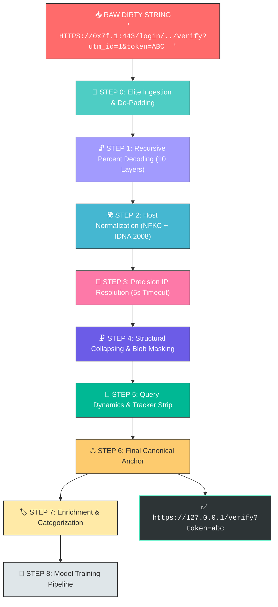
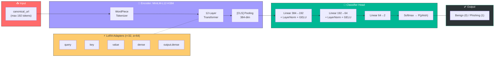

# 🔗 URL Preprocessing Architecture v8: Canonical Mode — "The Standard"

> **The Canonical URL Pipeline** — Heavy normalization for structural deduplication, database integrity, and clean-input classification.

---

## 🏛️ Architecture Overview

The Canonical URL pipeline strips URLs down to their **most stable structural core**. Canonical mode **eliminates noise** — resolving traversals, removing trackers, sorting parameters, and masking blobs.



---

## 📋 End-to-End Processing Steps

### Step 0 — Elite Ingestion & De-Padding

```text
┌──────────────────────────────────────────────────────────────────────────┐
│  STEP 0: ELITE INGESTION & DE-PADDING                                    │
├──────────────────────────────────────────────────────────────────────────┤
│  • PADDING STRIP:  Remove whitespace and junk (" " → "")  
│  • PROTOCOL FIX:   Induce "http://" for schemeless inputs -> Input: 192.168.0.10/dashboard --> http://192.168.0.10/dashboard│             
│  • IP CANONICAL:   Resolve Decimal, Hex, Octal, Mixed-base (0x7f.1 -> 127.0.0.1)(Elite Unmasking)│
│  • LOCAL REJECT:   Drop private/local IPs (if configured)                │
│  • UNIVERSAL LC:   Enforce lowercase (Parity with MiniLM Uncased)        │
└──────────────────────────────────────────────────────────────────────────┘
```

### Step 1 — Recursive Percent Decoding (10 Layers)

```text
┌──────────────────────────────────────────────────────────────────────────┐
│  STEP 1: RECURSIVE PERCENT DECODING (10 LAYERS)                          │
├──────────────────────────────────────────────────────────────────────────┤
│  • 10-Pass recursion to expose payloads hidden in deep fragments         │
│  • Prevents bypass via multi-encoded traversals (%25252e%25252e/)        │
│  • Converges when output stabilizes (no infinite loops)                  │
└──────────────────────────────────────────────────────────────────────────┘
```

> [!TIP]
> **Why 10 passes?** Double the standard 5-pass depth to catch "Recursive Evasion" — payloads hidden across many encoding layers to fool static analysis.

### Step 2 — Host Normalization

```text
┌──────────────────────────────────────────────────────────────────────────┐
│  STEP 2: HOST NORMALIZATION                                              │
├──────────────────────────────────────────────────────────────────────────┤
│  • NFKC + IDNA 2008 Punycode encoding                                   │
│  • Leading/Trailing dot stripping (.com. → com)                          │
│  • Unicode homoglyph resolution via NFKC                                 │
└──────────────────────────────────────────────────────────────────────────┘
```

### Step 3 — Precision IP Resolution (5s Timeout)

```text
┌──────────────────────────────────────────────────────────────────────────┐
│  STEP 3: PRECISION IP RESOLUTION (5s TIMEOUT)                            │
├──────────────────────────────────────────────────────────────────────────┤
│  • Reverse DNS → Domain Injection → Full Restart                        │
│  • 5.0 second precision to capture slow-responding ISP nodes             │
│  • Captures residential and mobile botnet infrastructure                 │
└──────────────────────────────────────────────────────────────────────────┘
```

### Step 4 — Structural Collapsing & Blob Masking

```text
┌──────────────────────────────────────────────────────────────────────────┐
│  STEP 4: STRUCTURAL COLLAPSING & BLOB MASKING                            │
├──────────────────────────────────────────────────────────────────────────┤
│  • PORT STRIPPING:  Remove default ports (:443, :80)                     │
│  • PATH SANITIZE:   Resolve traversals (/login/../ → /)                  │
│  • BLOB MASKING:    Mask HEX/B64 in path and fragment                    │
│                     (e.g., <base64_blob>, <hex_blob>)                    │
│  • FRAGMENT RIGOR:  High-entropy fragments masked for consistency        │
└──────────────────────────────────────────────────────────────────────────┘
```

### Step 5 — Query Dynamics & Tracker Strip

```text
┌──────────────────────────────────────────────────────────────────────────┐
│  STEP 5: QUERY DYNAMICS & TRACKER STRIP                                  │
├──────────────────────────────────────────────────────────────────────────┤
│  • TRACKER STRIP:   Remove 50+ tracking params (utm_*, gclid, fbclid)    │
│  • DETERMINISTIC:   Sort params alphabetically (a=1&b=2)                 │
│  • HEX ENFORCE:     Lowercase percent-encoding (%2A → %2a)              │
│  • SESSION STRIP:   Remove session IDs and CSRF tokens                   │
└──────────────────────────────────────────────────────────────────────────┘
```

### Step 6 — Final Canonical Anchor

```text
┌──────────────────────────────────────────────────────────────────────────┐
│  STEP 6: FINAL CANONICAL ANCHOR                                          │
├──────────────────────────────────────────────────────────────────────────┤
│  • NFKC + Punycode:   Host stability                                     │
│  • ASCII Enforced:     100% compatible with standard DB indexes          │
│  • TRAILING SLASH:     Normalize path termination                        │
│                                                                          │
│  [FINAL RESULT]                                                          │
│  https://127.0.0.1/verify?token=abc                                      │
└──────────────────────────────────────────────────────────────────────────┘
```

### Step 7 — Enrichment & Categorization (Same as OFP)

```text
┌──────────────────────────────────────────────────────────────────────────┐
│  STEP 7: ENRICHMENT & CATEGORIZATION                                     │
├──────────────────────────────────────────────────────────────────────────┤
│  • CAT-FLAGS:       Trigger 60+ security detectors                       │
│  • CATEGORIES:      16 primary groups (Brand, Script, TLD, etc.)         │         │
└──────────────────────────────────────────────────────────────────────────┘
```

### Step 8 — Model Training Pipeline (MiniLM + LoRA + Focal Loss)

> **Script:** `1_MiniLM_V2_Model_On_Raw_data_and_OFP_and_Canonical.py`
> **Target KPIs:** FPR ≤ 1% · FNR ≤ 10% · Accuracy ≥ 98% · Precision ≥ 95% · Recall ≥ 95%

---

#### 🏗️ 8.1 — Model Architecture



```text
┌──────────────────────────────────────────────────────────────────────────────┐
│  8.1  MODEL ARCHITECTURE — MiniLM-L12-H384 + LoRA                           │
├──────────────────────────────────────────────────────────────────────────────┤
│                                                                              │
│  canonical_url ──▶ [WordPiece Tokenizer (max_len=192)] ──▶ token_ids        │
│                                                                              │
│  token_ids ──▶ ┌─────────────────────────────────────┐                      │
│                │  MiniLM-L12-H384 Transformer          │                      │
│                │  • 12 Attention Layers                 │                      │
│                │  • 384-dim Hidden Size                 │                      │
│                │  • 12 Attention Heads                  │                      │
│                │  + LoRA Adapters on 5 target modules   │                      │
│                │    ├─ query  ─┐                       │                      │
│                │    ├─ key    ─┤  r=32, α=64           │                      │
│                │    ├─ value  ─┤  dropout=0.05         │                      │
│                │    ├─ dense  ─┤                       │                      │
│                │    └─ output ─┘                       │                      │
│                └─────────────────────────────────────┘                      │
│                              │                                               │
│                     [CLS] Token Pooling                                      │
│                              │                                               │
│                         384-dim embedding                                    │
│                              │                                               │
│                ┌─────────────────────────────────┐                           │
│                │  Classifier Head (Bottleneck)     │                           │
│                │  384 → 192  (LayerNorm + GELU)    │                           │
│                │  192 → 64   (LayerNorm + GELU)    │                           │
│                │   64 → 2    (Binary Logits)       │                           │
│                │  Dropout: 0.15 per block          │                           │
│                │  Init: Xavier Normal (gain=0.02)   │                           │
│                └─────────────────────────────────┘                           │
│                              │                                               │
│                     Softmax → P(phishing)                                    │
│                              │                                               │
│                   Benign (0) / Phishing (1)                                  │
│                                                                              │
└──────────────────────────────────────────────────────────────────────────────┘
```

> [!TIP]
> **Why LoRA r=32?** With 26.5M+ training samples, higher-rank adapters allow the model to memorize hard edge-cases (zero-day phishing patterns) while keeping 97%+ of the base model frozen. The `α=64` (2×r) scaling ensures adapter gradients are strong enough to converge in just 3 epochs.

---

#### 📊 8.1 — Training Configuration Summary

| Parameter | Value | Rationale |
| :--- | :--- | :--- |
| **Batch Size** | `128` | Large batches for stable gradient estimates on 26.5M samples |
| **Effective Batch** | `256` | Via 2× gradient accumulation |
| **Epochs** | `3` | 26.5M × 3 = 80M+ samples seen — sufficient with higher LR |
| **Learning Rate** | `1e-4` | Boosted for LoRA convergence within 3-epoch budget |
| **Warmup** | `3%` of steps | Prevents initial gradient explosion |
| **Weight Decay** | `0.01` | Relaxed — massive dataset virtually eliminates overfitting |
| **Dropout** | `0.15` | Per classifier block — additional regularization for small head |
| **Max Sequence Length** | `192` tokens | Canonical URLs avg ~80 chars; 192 covers 99th percentile |
| **LoRA Rank (r)** | `32` | High capacity for edge-case memorization |
| **LoRA Alpha (α)** | `64` | 2×r scaling — best practice for classification |
| **LoRA Dropout** | `0.05` | Minimal — 26.5M samples = negligible overfit risk |
| **LoRA Targets** | `query, key, value, dense, output.dense` | All attention + FFN layers adapted |
| **Focal γ** | `2.5` | Hard-sample mining for strict FPR/FNR |
| **Focal α** | `[0.284, 0.716]` | Exact inverse of benign:phishing ratio |
| **Label Smoothing** | `0.05` | Probability calibration at extreme thresholds |
| **AMP** | `Enabled` | FP16 forward/backward, ~2× GPU throughput |
| **Early Stopping** | Patience = `3` | Matches epoch budget |
| **Seed** | `42` | Full deterministic reproducibility (CUDA included) |

---

#### 🎯 8.5 — KPI Evaluator & Strict Threshold Optimization

```text
┌──────────────────────────────────────────────────────────────────────────────┐
│  8.5  ENHANCED KPI EVALUATOR — MULTI-OBJECTIVE THRESHOLD SEARCH              │
├──────────────────────────────────────────────────────────────────────────────┤
│                                                                              │
│  STRATEGY (per epoch, on validation set):                                    │
│                                                                              │
│  1. Sweep 120 thresholds from 0.25 to 0.85 (step=0.005)                     │
│                                                                              │
│  2. For EACH threshold, compute:                                             │
│     ┌──────────────────────────────────────────┐                            │
│     │  • FPR = FP / (FP + TN)   target ≤ 1%    │                            │
│     │  • FNR = FN / (FN + TP)   target ≤ 10%   │                            │
│     │  • Precision               target ≥ 95%   │                            │
│     │  • Recall                  target ≥ 95%   │                            │
│     │  • Accuracy                target ≥ 98%   │                            │
│     │  • F1 Score                               │                            │
│     │  • AUC-ROC                                │                            │
│     │  • Specificity, NPV                       │                            │
│     └──────────────────────────────────────────┘                            │
│                                                                              │
│  3. FILTER: Keep only thresholds where FPR ≤ 1% AND FNR ≤ 10%              │
│                                                                              │
│  4. SELECT: Among valid thresholds, pick the one maximizing F1              │
│     (with fallback to minimum-violation if no valid threshold exists)        │
│                                                                              │                          │
│                                                                              │
└──────────────────────────────────────────────────────────────────────────────┘
```

> [!NOTE]
> The threshold optimizer runs on every epoch's validation set. The model is saved only when `kpi_score` improves, ensuring the exported artifact is always the globally best checkpoint seen during training.

---

## 🚀 Performance & Scalability

- **Multi-Processing**: 12+ cores via refined `ProcessPoolExecutor` with crash resilience
- **10-Pass Recursive Decoding**: Catches deeply nested evasion techniques
- **Precision DNS**: 5.0s timeout captures slow ISP nodes used in botnet campaigns
- **Fragment Blob Masking**: High-entropy fragments masked for structural consistency
- **Memory Efficient**: Chunk-based processing maintains fixed memory footprint on 40M+ URLs

---

> [!NOTE]
> The canonical mode produces **cleaner** input for the model, eliminating noise from trackers and randomized tokens.  
---

*PhishURL Research Pipeline — v7 Canonical Architecture*
