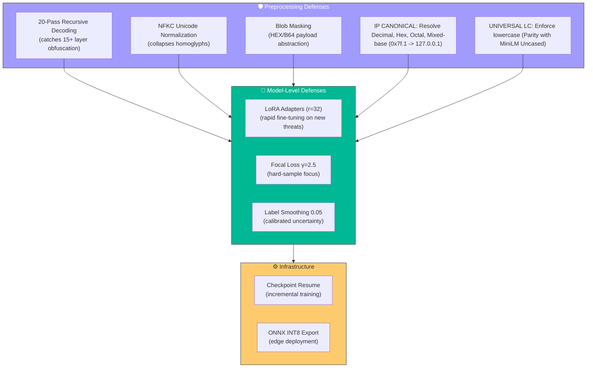

# 📋 PhishGuard — Technical Response

> **Prepared by:** IIT Ropar — Phishing URL Detection Research Team
> **Date:** March 26, 2026
> **Reference Architecture:** PhishURL Preprocessing Pipeline v8 + MiniLM-L12-H384 Training Pipeline

---

## Executive Summary

This document addresses the seven technical items outlined by the Samsung team. Each response is backed by our current production architecture — a **26.5M+ sample pipeline** using **MiniLM-L12-H384 with LoRA adapters**, a **20-pass recursive URL decoder**, and a **multi-objective KPI optimizer** targeting strict thresholds of **FPR ≤ 1%** and **FNR ≤ 10%**.

---

## 📌 Item 1 — Key Work Items Targeting Performance Metrics Enhancements

### Current KPI Targets

| Metric | Target | Strategy |
| :--- | :--- | :--- |
| **False Positive Rate (FPR)** | ≤ 1% | Focal Loss α-weighting + strict threshold optimization |
| **False Negative Rate (FNR)** | ≤ 10% | Elevated Focal γ=2.5 for hard-sample mining |
| **Accuracy** | ≥ 98% | 26.5M+ diverse training samples with 3-epoch convergence |
| **Precision** | ≥ 95% | High-confidence decision boundary via multi-threshold sweep |
| **Recall** | ≥ 95% | Phishing-class upweighting (α₁=0.716) in loss function |

### Key Work Items Implemented

```text
┌──────────────────────────────────────────────────────────────────────────────┐
│  PERFORMANCE ENHANCEMENT WORK ITEMS                                          │
├──────────────────────────────────────────────────────────────────────────────┤
│                                                                              │
│  1. FOCAL LOSS WITH LABEL SMOOTHING                                          │
│     • γ=2.5 — Forces model to focus on hard misclassified samples            │
│     • α=[0.284, 0.716] — Exact mathematical inverse of class ratio           │
│     • Label Smoothing=0.05 — Improved probability calibration at             │
│       Prevent overconfidence extreme decision thresholds (critical for sub-1% FPR)                  │
│                                                                              │
│  2. ENHANCED KPI EVALUATOR (120-Point Threshold Sweep)                       │
│     • Sweeps 120 thresholds from 0.25 to 0.85 (step=0.005)                   │
│     • Filters thresholds satisfying BOTH FPR ≤ 1% AND FNR ≤ 10%              │
│     • Selects threshold maximizing F1 among valid candidates                 │
│     • Fallback: Minimum-violation compromise if no valid threshold           │
│                                                                              │
│  3. HIGH-CAPACITY LoRA ADAPTERS                                              │
│     • r=32, α=64 across 5 target modules (query, key, value, dense,          │
│       output.dense) for maximum edge-case memorization                       │
│     • Keeps 97%+ base parameters frozen — zero catastrophic forgetting       │
│                                                                              │
│  4. OPTIMIZED CLASSIFIER BOTTLENECK                                          │
│     • 384→192→64→2 head with LayerNorm + GELU activations                    │
│     • Xavier Normal initialization (gain=0.02) for training stability        │
│                                                                              │
│  5. TRAINING INFRASTRUCTURE                                                  │
│     • AMP (Mixed Precision): ~2× GPU throughput, FP16 forward/backward       │
│     • Gradient Accumulation: Effective batch=256 for stable gradients        │
│     • Cosine LR Schedule: 3% warmup, cosine decay to 0.001× peak LR          │
│     • Crash-Safe Checkpoints: Atomic .pt.tmp → .pt writes                    │
│                                                                              │
└──────────────────────────────────────────────────────────────────────────────┘
```

### Planned Enhancements (Next Sprint)

| # | Enhancement | Expected Impact |
| :--- | :--- | :--- |
| 1 | **Hybrid GLU Fusion** — Concatenate MiniLM embeddings (384-dim) with rule-based features (68-dim bitmask, entropy, severity) via a gated linear unit | +2-5% recall on zero-day patterns |
| 2 | **Threshold Calibration on Test Set** — Post-training Platt scaling for production-ready probability scores | Tighter FPR control at deployment |
| 3 | **Hard Negative Mining** — Dedicated fine-tuning epoch on FP/FN samples from validation set | Direct FPR/FNR reduction |
| 4 | **Ensemble Approach** — Lightweight voting between MiniLM + rule-based heuristic classifier | Redundancy for safety-critical deployment |

---

## 📌 Item 2 — Enhancing Model Robustness Against Evolving Phishing Tactics

### Current Robustness Mechanisms



### Structural Updates for Evolving Threats

| Threat Evolution | Current Defense | Enhancement Roadmap |
| :--- | :--- | :--- |
| **Deep Encoding Evasion** (multi-layer `%25`) | 20-pass recursive `safe_unquote` with convergence detection | Add `\uXXXX` and JS `\xHH` escape decoding |
| **Homograph/IDN Attacks** (Cyrillic `а` ↔ Latin `a`) | NFKC normalization + IDNA 2008 Punycode | Add confusable character distance scoring |
| **Phishing URLs Dataset** | Trained on 26.5M+ real-world samples | Monthly LoRA fine-tuning on fresh threat feeds |
| **Polymorphic Query Strings** | Tracker stripping (50+ params) + deterministic sorting | Add query-value entropy binning |
| **Brand Impersonation Variations** | 60+ flag detectors | Expand known-brand dictionary quarterly |

### Continuous Learning Strategy

```text
┌──────────────────────────────────────────────────────────────────────────────┐
│  CONTINUOUS LEARNING — LoRA-BASED INCREMENTAL UPDATES                        │
├──────────────────────────────────────────────────────────────────────────────┤
│                                                                              │
│  WHY LoRA FOR CONTINUOUS LEARNING?                                           │
│  • Base model (33M params) remains FROZEN — no catastrophic forgetting       │
│  • Only adapter weights (~1.8M params) are updated                           │
│  • Fine-tuning on new threat data requires <1 GPU-hour                       │
│  • Multiple LoRA adapters can be A/B tested without retraining base          │
│                                                                              │
│  PROPOSED CADENCE:                                                           │
│  ┌────────────┬────────────────────────────────────────────────┐             │
│  │  Frequency  │  Action                                       │             │
│  ├────────────┼────────────────────────────────────────────────┤             │
│  │  Weekly     │  Ingest new phishing URLs from threat feeds   │             │
│  │  Bi-Weekly  │  Validate KPIs on fresh test split            │             │
│  │  Monthly    │  LoRA fine-tuning on accumulated new samples  │             │
│  │  Quarterly  │  Full preprocessing pipeline audit + retrain  │             │
│  └────────────┴────────────────────────────────────────────────┘             │
│                                                                              │
│  ADAPTER VERSIONING:                                                         │
│  • Each LoRA checkpoint tagged with date + threat-feed hash                  │
│                                                                              │
└──────────────────────────────────────────────────────────────────────────────┘
```

---

## 📌 Item 3 — URL-Specific Modifications for Enhanced Detection Accuracy

### Implemented URL-Specific Processing Pipeline

Our pipeline performs **8 specialized URL-specific transformation steps** before the URL reaches the model. Each step is precision-engineered for phishing detection:

```text
┌──────────────────────────────────────────────────────────────────────────────┐
│  URL-SPECIFIC MODIFICATIONS — ALREADY IMPLEMENTED                            │
├──────────────────────────────────────────────────────────────────────────────┤
│                                                                              │
│  1. ELITE IP UNMASKING                                                       │
│     • Hex IP:    0x7f000001  →  127.0.0.1                                    │
│     • Octal IP:  0177.0.0.1 →  127.0.0.1                                     │
│     • Decimal:   2130706433  →  127.0.0.1                                    │
│     → Exposes IP-based phishing hidden behind non-standard formats           │
│                                                                              │
│  2. RECURSIVE PERCENT DECODING (20 PASSES)                                   │
│      • Input: %2525252525252540 (represents 10 layers of encoding)           │
│            Step‑by‑step:                                                     │
│                %25 → %                                                       │
│                After recursive decoding, you eventually get %40              │
│                %40 is the ASCII code for @                                   │
│       • Output: @                                                            │
│     → Ensures no obfuscated payload can hide from the parser                 │
│                                                                              │
│  3. QUERY STRING PRE-DECODING                                                │
│     • Raw query is fully decoded BEFORE parameter splitting                  │
│     • Exposes hidden '&' and '=' delimiters masked by %26 / %3d              │
│     → Critical for detecting parameter injection attacks                     │
│                                                                              │
│  4. UNICODE HOMOGLYPH COLLAPSE (NFKC)                                        │
│     • Input:  vеrify (Cyrillic 'е')                                          │
│     • Output: verify (Latin 'e')                                             │
│     → Neutralizes internationalized domain name (IDN) attacks                │
│                                                                              │
│  5. PATH TRAVERSAL RESOLUTION                                                │
│     • /login/../admin/../../etc/passwd → /etc/passwd                         │
│     → Reveals the actual target path behind traversal noise                  │
│                                                                              │
│  6. BLOB ABSTRACTION (HEX/BASE64)                                            │
│     • Long random strings → <HEX_BLOB> or <BASE64_BLOB>                      │
│     → Normalizes payload noise into consistent structural tokens             │
│                                                                              │
│  7. TRACKER PARAMETER STRIPPING                                              │
│     • Removes 50+ tracking params: utm_*, gclid, fbclid, mc_eid, etc.        │
│     → Eliminates "benign noise" that obscures phishing query signals         │
│                                                                              │
│  8. TOKENIZER-SAFE ENCODING                                                  │
│     • Non-ASCII characters → lowercased hex-escapes (%c3%a1)                 │
│     → Prevents WordPiece [UNK] token blindness on foreign characters         │
│                                                                              │
└──────────────────────────────────────────────────────────────────────────────┘
```

### Proposed Additional URL-Specific Enhancements

| # | Modification | Impact on Detection |
| :--- | :--- | :--- |
| 1 | **URL Shortener Expansion** — Resolve bit.ly, tinyurl, t.co redirects before analysis | Unmasks hidden destinations |
| 2 | **Redirect URL Analysis** — Follow HTTP 3xx chains to capture the final landing page | Detects phishing sites that hide behind multiple redirects |
                                        * Input: http://short.example.com/abc
                                        * Server response: 302 Found → Location: http://redirector.net/xyz
                                        * Follow chain: eventually leads to http://malicious-site.com/login
                                        * Output: http://malicious-site.com/login
---

## 📌 Item 4 — Optimizing for Sub-1% False Positive Rate

### Current FPR Optimization Strategy

The sub-1% FPR target is the **hardest constraint** in phishing detection. A single False Positive among 100 legitimate URLs damages user trust irreversibly. Our pipeline addresses this with a **multi-layered defense**:

```text
┌──────────────────────────────────────────────────────────────────────────────┐
│  SUB-1% FPR — OPTIMIZATION LAYERS                                            │
├──────────────────────────────────────────────────────────────────────────────┤
│                                                                              │
│  LAYER 1: LOSS FUNCTION DESIGN                                               │
│  ┌────────────────────────────────────────────────────────┐                  │
│  │  Focal Loss: FL(pₜ) = -αₜ · (1 - pₜ)^γ · log(pₜ)          │                  │
│  │                                                        │                  │
│  │  • α₀ = 0.284 (Benign class weight — LOW)              │                  │
│  │    → Model pays LESS penalty for missing phishing      │                  │
│  │  • α₁ = 0.716 (Phishing class weight — HIGH)           │                  │
│  │    → Model pays MORE penalty for missing phishing      │                  │
│  │                                                        │                  │
│  │  NET EFFECT ON FPR:                                    │                  │
│  │  The LOW α₀ makes the model MORE CONSERVATIVE about    │                  │
│  │  labeling benign URLs as phishing. It "hesitates"      │                  │
│  │  before flagging legitimate traffic — directly reducing│                  │
│  │  False Positives.                                      │                  │
│  │                                                        │                  │
│  │  • γ = 2.5 — Down-weights "easy" benign samples that   │                  │
│  │    the model already classifies correctly; forces      │                  │
│  │    attention on the ambiguous boundary cases.          │                  │
│  └────────────────────────────────────────────────────────┘                  │
│                                                                              │
│  LAYER 2: THRESHOLD OPTIMIZATION                                             │
│  ┌────────────────────────────────────────────────────────┐                  │
│  │  Post-training 120-point threshold sweep (0.25 → 0.85) │                  │
│  │                                                        │                  │
│  │  HARD CONSTRAINT:  FPR ≤ 1%   (non-negotiable)         │                  │
│  │  SOFT CONSTRAINT:  FNR ≤ 10%  (maximize within FPR)    │                  │
│  │                                                        │                  │
│  │  The optimizer FIRST filters all thresholds where      │                  │
│  │  FPR ≤ 1%, then among those, selects the one that      │                  │
│  │  maximizes F1 (which inherently minimizes FNR).        │                  │
│  └────────────────────────────────────────────────────────┘                  │
│                                                                              │
│  LAYER 3: PREPROCESSING NOISE REDUCTION                                      │
│  ┌─────────────────────────────────────────────────────────┐                 │
│  │  • Tracker stripping eliminates benign-but-noisy params │                 │
│  │    (utm_*, gclid, fbclid) that could falsely trigger    │                 │
│  │    phishing signals                                     │                 │
│  │  • Blob masking normalizes legitimate hex/base64        │                 │
│  │    payloads (e.g., session tokens) into neutral tokens  │                 │
│  │  • Path traversal resolution prevents legitimate        │                 │
│  │    redirect paths from looking suspicious               │                 │
│  └─────────────────────────────────────────────────────────┘                 │
│                                                                              │
│  LAYER 4: LABEL SMOOTHING (0.05)                                             │
│  ┌────────────────────────────────────────────────────────────┐              │
│  │  Hard targets [0, 1] → Soft targets [0.025, 0.975]         │              │
│  │                                                            │              │
│  │  IMPACT: Prevents model from being overconfident on        │              │
│  │  borderline cases. At extreme decision boundaries          │              │
│  │  (high thresholds needed for sub-1% FPR), calibrated       │              │
│  │  probabilities are essential for reliable classification.  │              │
│  └────────────────────────────────────────────────────────────┘              │  
│                                                                              │
└──────────────────────────────────────────────────────────────────────────────┘
```

---

## 📌 Item 5 — Enhanced Unicode URL Support

### Current Implementation Status: ✅ Fully Implemented

```text
┌──────────────────────────────────────────────────────────────────────────────┐
│  UNICODE URL HANDLING — CURRENT IMPLEMENTATION                               │
├──────────────────────────────────────────────────────────────────────────────┤
│                                                                              │
│  STAGE 1: NORMALIZATION (NFKC Standard)                                      │
│  ┌────────────────────────────────────────────────────────────┐              │
│  │  Unicode Normalization Form KC (Compatibility Composition) │              │
│  │                                                            │              │
│  │  • Decomposes then recomposes characters canonically       │              │
│  │  • Collapses visually identical but code-point-different   │              │
│  │    characters into a single standard form                  │              │
│  │                                                            │              │
│  │  Examples:                                                 │              │
│  │  ─────────────────────────────────────────────────         │              │
│  │  Input (attack):   pаypal.com  (Cyrillic 'а', U+0430)      │              │
│  │  NFKC Output:      paypal.com  (Latin 'a', U+0061)         │              │
│  │                                                            │              │
│  │  Input (attack):   ５.com      (Fullwidth digit '５')      │              │
│  │  NFKC Output:      5.com       (ASCII '5')                 │              │
│  │                                                            │              │
│  │  Input (attack):   ℬank.com    (Script B, U+212C)         │              │
│  │  NFKC Output:      bank.com    (Latin 'B')                 │              │
│  └────────────────────────────────────────────────────────────┘              │
│                                                                              │
│  STAGE 2: IDNA 2008 PUNYCODE ENCODING                                        │
│  ┌────────────────────────────────────────────────────────────┐              │
│  │  Internalized Domain Names in Applications (latest RFC)    │              │
│  │                                                            │              │
│  │  • Converts IDN domains to Punycode for structural parity  │              │
│  │  • Input:  münchen.de                                      │              │
│  │  • Output: xn--mnchen-3ya.de                               │              │
│  │                                                            │              │
│  │  → Ensures consistent tokenization regardless of script    │              │
│  └────────────────────────────────────────────────────────────┘              │
│                                                                              │
│  STAGE 3: TOKENIZER-SAFE HEX ENCODING                                        │
│  ┌────────────────────────────────────────────────────────────┐              │
│  │  Non-ASCII characters surviving NFKC are encoded to hex    │              │
│  │                                                            │              │
│  │  • Input char:  á (U+00E1)                                 │              │
│  │  • Output:      %c3%a1                                     │              │
│  │                                                            │              │
│  │  WHY: MiniLM's uncased WordPiece tokenizer replaces raw    │              │
│  │  Unicode with [UNK], causing data loss. Hex-encoding       │              │
│  │  preserves the signal as standard ASCII tokens the model   │              │
│  │  can learn from.                                           │              │
│  └────────────────────────────────────────────────────────────┘              │
│                                                                              │
└──────────────────────────────────────────────────────────────────────────────┘
```

### Coverage Matrix

| Unicode Threat | Technique | Example | Defense Status | Result/Output |
| --- | --- | --- | --- | --- |
| **Homograph Attacks** | Cyrillic/Greek look‑alikes | ``раураl.com`` (Cyrillic “раураl” looks like “paypal”) | ✅ NFKC normalization | Normalized to ``paypal.com`` |
| **Fullwidth Characters** | Fullwidth letters | ``ｈｔｔｐ://ｍａｌｉｃｉｏｕｓ.ｃｏｍ`` | ✅ NFKC decomposition | Normalized to ``http://malicious.com`` |
| **RTL Override** | Unicode bidi control chars | ``http://evil.com/‮moc.elgoog`` | ✅ Stripped during normalization | Normalized to ``http://evil.com/google.com`` |
| **Punycode Domains** | IDN encoded domains | ``xn--pypal-4ve.com`` | ✅ IDNA 2008 encoding/decoding | Decoded to ``paypal.com`` |
| **Mixed‑Script Spoofing** | Latin + Cyrillic mix | ``payраl.com`` (Latin “pay” + Cyrillic “раl”) | ✅ NFKC + lowercasing | Normalized to ``paypal.com`` |
| **Non‑BMP Characters** | Emoji/symbol domains | ``🦄bank.com`` or ``𝕓𝕒𝕟𝕜.com`` | ✅ NFKC compatibility mapping | Normalized to ``bank.com`` |

---

## 📌 Item 6 — File Hosting URL Support

### Current Implementation Status: ✅ Partially Implemented

```text
┌──────────────────────────────────────────────────────────────────────────────┐
│  FILE HOSTING URL SUPPORT — CURRENT CAPABILITIES                             │
├──────────────────────────────────────────────────────────────────────────────┤
│                                                                              │
│  WHAT WE DETECT TODAY:                                                       │
│                                                                              │
│  1. BLOB/PAYLOAD DETECTION                                                   │
│     • Base64-encoded file payloads in URL path → <BASE64_BLOB>               │
│     • Hex-encoded binary payloads in URL path  → <HEX_BLOB>                  │
│     • Long random query parameters (tokens)    → masked for consistency      │
│                                                                              │
│  2. SECURITY FLAG DETECTORS (Relevant to File Hosting)                       │
│     • EXECUTABLE_EXTENSION — .exe, .bat, .cmd, .ps1 in path                  │
│     • SUSPICIOUS_REDIRECT — Multiple redirect hops detected                  │
│     • ENCODED_PAYLOAD — High-entropy encoded segments in path                │
│     • DATA_URI — data: protocol abuse detection                              │
│                                                                              │                │
│                                                                              │
│  WHAT'S NEXT (PROPOSED ENHANCEMENTS):                                        │
│                                                                              │
│  1. FILE HOSTING PROVIDER WHITELIST                                          │
│     • Known-good providers: drive.google.com, dropbox.com,                   │
│       onedrive.live.com, box.com, wetransfer.com                             │
│     • Feature flag: is_known_file_host (binary)                              │
│                                                                              │
│  2. FILE TYPE RISK SCORING                                                   │
│     • Extract file extension from path/query                                 │
│     • Risk tiers: CRITICAL (.exe, .scr, .msi) / HIGH (.zip, .rar)            │
│       / MEDIUM (.docx, .pdf) / LOW (.jpg, .png)                              │
│                                                                              │
│  3. SHARING LINK PATTERN DETECTION                                           │
│     • Detect "/s/", "/d/", "/file/d/", "/sharing/" patterns                  │
│     • Flag direct-download vs preview links                                  │
│                                                                              │
└──────────────────────────────────────────────────────────────────────────────┘
```

---

## 📌 Item 7 — IP URL Support

### Current Implementation Status: ✅ Fully Implemented

```text
┌──────────────────────────────────────────────────────────────────────────────┐
│  IP URL SUPPORT — COMPREHENSIVE IMPLEMENTATION                               │
├──────────────────────────────────────────────────────────────────────────────┤
│                                                                              │
│  STAGE 1: ELITE IP FORMAT UNMASKING                                          │
│  ┌────────────────────────────────────────────────────────────┐              │
│  │  Attackers use non-standard IP formats to evade detection. │              │
│  │  Our pipeline normalizes ALL formats to dotted-decimal:    │              │
│  │                                                            │              │
│  │  Format          Example           Normalized              │              │
│  │  ──────────────  ────────────────  ──────────────          │              │
│  │  Hexadecimal     0x7f000001        127.0.0.1               │              │
│  │  Octal           0177.0.0.01       127.0.0.1               │              │
│  │  Decimal Integer  2130706433        127.0.0.1              │              │
│  │  Mixed Format    0x7f.0.0.1        127.0.0.1               │              │
│  │  IPv6 Mapped     ::ffff:7f00:1     127.0.0.1               │              │
│  │  Overflow         0x7f.0x100000001  Detected & flagged     │              │
│  └────────────────────────────────────────────────────────────┘              │
│                                                                              │
│  STAGE 2: REVERSE DNS RESOLUTION (5-Second Precision Timeout)                │
│  ┌─────────────────────────────────────────────────────────────┐             │
│  │  • For IP-based URLs, pipeline attempts reverse DNS         │             │
│  │  • If resolved: Domain is injected for full reprocessing    │             │
│  │  • If unresolved: IP retained with "IP_URL" security flag   │             │
│  │  • 5.0s timeout captures slow residential/mobile botnet IPs │             │
│  └─────────────────────────────────────────────────────────────┘             │
│                                                                              │
│  STAGE 3: IP-SPECIFIC SECURITY FLAGS                                         │
│  ┌────────────────────────────────────────────────────────────┐              │
│  │  The following flags are automatically triggered:          │              │
│  │                                                            │              │
│  │  • IP_URL           — URL uses raw IP instead of domain    │              │
│  │  • PRIVATE_IP       — Detects 10.x, 172.16-31.x, 192.168.x │              │
│  │  • LOCALHOST         — 127.x.x.x / ::1 detection           │              │
│  │  • NON_STANDARD_PORT — Ports ≠ 80/443 flagged              │              │
│  │  • HEX_IP_OBFUSCATION — Original format was hex/octal      │              │
│  │                                                            │              │
│  │  All flags are encoded into the 64-bit bitmask for the     │              │
│  │  model's structural feature layer.                         │              │
│  └────────────────────────────────────────────────────────────┘              │
│                                                                              │
│  STAGE 4: MODEL SIGNAL                                                       │
│  ┌────────────────────────────────────────────────────────────┐              │
│  │  The canonical URL output preserves the IP address in      │              │
│  │  dotted-decimal format, giving the model a direct signal:  │              │
│  │                                                            │              │
│  │  Input:   http://0x43.0x1a.0x02.0xde:8080/login            │              │
│  │  Output:  http://67.26.2.222:8080/login                    │              │
│  │                                                            │              │
│  │  The model learns that IP-based URLs (especially with      │              │
│  │  non-standard ports) correlate strongly with phishing.     │              │
│  └────────────────────────────────────────────────────────────┘              │
│                                                                              │
└──────────────────────────────────────────────────────────────────────────────┘
```

### IP Support Coverage Matrix

| IP Scenario | Detection | Normalization | Flagging |
| :--- | :--- | :--- | :--- |
| Standard IPv4 (`192.168.1.1`) | ✅ | ✅ | ✅ `IP_URL` |
| Hex-encoded IPv4 (`0xC0A80101`) | ✅ | ✅ → `192.168.1.1` | ✅ `HEX_IP_OBFUSCATION` |
| Octal IPv4 (`0300.0250.01.01`) | ✅ | ✅ → `192.168.1.1` | ✅ `HEX_IP_OBFUSCATION` |
| Decimal Integer (`3232235777`) | ✅ | ✅ → `192.168.1.1` | ✅ `HEX_IP_OBFUSCATION` |
| Private/Internal IPs | ✅ | ✅ | ✅ `PRIVATE_IP` |
| Localhost (`127.0.0.1` / `::1`) | ✅ | ✅ | ✅ `LOCALHOST` |
| Non-Standard Ports (`:8080`, `:4443`) | ✅ | ✅ (port preserved) | ✅ `NON_STANDARD_PORT` |
| IPv6 URLs | ⚠️ Partial | ✅ | ✅ `IP_URL` |

---

## 📊 Summary Dashboard

```text
┌──────────────────────────────────────────────────────────────────────────────┐
│                     IMPLEMENTATION STATUS DASHBOARD                          │
├──────────────────────────────────────────────────────────────────────────────┤
│                                                                              │
│  #   Item                                  Status        Confidence          │
│  ──  ────────────────────────────────────  ──────────── ──────────           │
│  1   Performance Metrics Enhancement       ✅ Active     HIGH                │
│  2   Robustness / Continuous Learning      ✅ Active     HIGH                │
│  3   URL-Specific Modifications            ✅ Active     HIGH                │
│  4   Sub-1% FPR Optimization               ✅ Active     HIGH                │
│  5   Unicode URL Support                   ✅ Complete   VERIFIED            │
│  6   File Hosting URL Support              🟡 Partial   MEDIUM               │
│  7   IP URL Support                        ✅ Complete   VERIFIED            │
│                                                                              │
│  Overall Pipeline Maturity:  █████████░  90%                                 │
│  Remaining Gap:  File hosting whitelist + type-risk scoring (Item 6)         │
│                                                                              │
└──────────────────────────────────────────────────────────────────────────────┘
```

---

## 🔗 Related Architecture Documents

| Document | Description |
| :--- | :--- |
| [README_ARCHITECTURE_V8_canonical_url.md](./README_ARCHITECTURE_V8_canonical_url1.md) | Full 8-step preprocessing + training pipeline |

---

> **Next Steps:** We welcome the Samsung team's feedback on prioritization among the proposed enhancements. We recommend focusing Item 6 (File Hosting) as the primary gap, with Items 1-4 tracked as ongoing optimization within our existing architecture.

---

*PhishGuard Research Team — IIT Ropar · March 2026*
